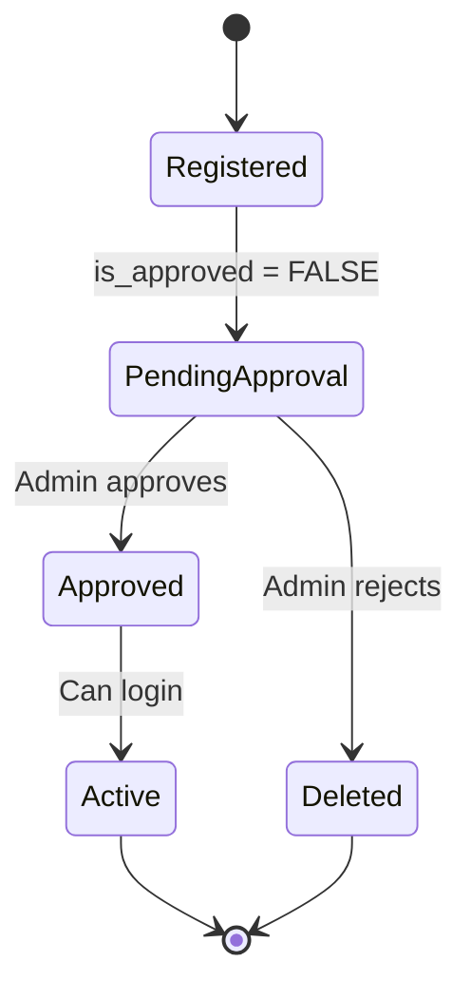

# Implementación Técnica - Sistema de Aprobación de Usuarios

## 📋 Resumen Ejecutivo

Se ha implementado un **sistema completo de auto-registro con aprobación de administrador** y **filtrado de evaluaciones por organización**. Esta funcionalidad permite que usuarios se registren ellos mismos, pero requiere que un administrador apruebe sus cuentas antes de que puedan acceder al sistema. Además, los usuarios regulares solo pueden ver y gestionar evaluaciones de su propia organización.

---

## 🏗️ Arquitectura de la Solución

### Capas Implementadas

```
┌─────────────────────────────────────────────────┐
│           FRONTEND UI (app.js, auth-ui.js)      │
│  - Registration Form with Organization Selector  │
│  - Pending/Active Users UI                      │
│  - Approve/Reject Buttons                       │
│  - Organization-filtered Assessment List        │
└─────────────────────────────────────────────────┘
                        ↓
┌─────────────────────────────────────────────────┐
│         BACKEND API (src/index.tsx)             │
│  - POST /api/auth/register (with org_id)        │
│  - POST /api/auth/login (approval check)        │
│  - POST /api/users/:id/approve                  │
│  - POST /api/users/:id/reject                   │
│  - GET /api/assessments (filtered by org)       │
└─────────────────────────────────────────────────┘
                        ↓
┌─────────────────────────────────────────────────┐
│      DATABASE (Cloudflare D1 - SQLite)          │
│  - users.organization_id (FK to organizations)  │
│  - users.is_approved (BOOLEAN, default FALSE)   │
│  - Migration: 0007_user_organization_and_approval│
└─────────────────────────────────────────────────┘
```

---

## 🗄️ Cambios en Base de Datos

### Migration 0007: `user_organization_and_approval.sql`

```sql
-- Agregar columna organization_id (NULLABLE para usuarios legacy)
ALTER TABLE users ADD COLUMN organization_id INTEGER REFERENCES organizations(id);

-- Agregar columna is_approved (default FALSE para auto-registro)
ALTER TABLE users ADD COLUMN is_approved BOOLEAN DEFAULT 0;

-- Migrar usuarios existentes (aprobarlos automáticamente)
UPDATE users SET is_approved = 1 WHERE is_approved IS NULL;

-- Crear índice para performance
CREATE INDEX IF NOT EXISTS idx_users_organization ON users(organization_id);
CREATE INDEX IF NOT EXISTS idx_users_approved ON users(is_approved);
```

#### Impacto en Producción
- **Queries ejecutadas**: 6
- **Rows escritas**: 22
- **Database size**: 0.37 MB
- **Downtime**: 0 (migración online)

### Esquema Actualizado - Tabla `users`

| Columna | Tipo | Constraints | Descripción |
|---------|------|-------------|-------------|
| `id` | INTEGER | PRIMARY KEY | ID único del usuario |
| `email` | TEXT | UNIQUE, NOT NULL | Email (usado para login) |
| `name` | TEXT | NOT NULL | Nombre completo |
| `password_hash` | TEXT | NOT NULL | Hash bcrypt del password |
| `role` | TEXT | NOT NULL, DEFAULT 'user' | 'admin' o 'user' |
| `is_active` | BOOLEAN | DEFAULT 1 | Usuario activo/inactivo |
| **`organization_id`** | INTEGER | **FK → organizations(id)** | **Organización del usuario** |
| **`is_approved`** | BOOLEAN | **DEFAULT 0** | **Aprobado por admin** |
| `created_at` | DATETIME | DEFAULT CURRENT_TIMESTAMP | Fecha de creación |

---

## 🔧 Cambios en Backend API

### 1. POST `/api/auth/register`

**Antes:**
```typescript
// Solo creaba usuario y retornaba token (auto-login)
const userId = await insertUser(email, name, hashedPassword);
return c.json({ user, token });
```

**AHORA:**
```typescript
// Requiere organization_id, marca is_approved = FALSE
const { name, email, password, organization_id } = await c.req.json();

// Validación
if (!organization_id) {
  return c.json({ error: 'Organization is required' }, 400);
}

// Crear usuario SIN aprobar
const result = await env.DB.prepare(`
  INSERT INTO users (email, name, password_hash, role, organization_id, is_approved, is_active)
  VALUES (?, ?, ?, 'user', ?, 0, 1)
`).bind(email, name, hashedPassword, organization_id).run();

// NO se retorna token, solo mensaje de éxito
return c.json({ 
  message: 'Registration successful! Please wait for administrator approval.',
  pending_approval: true 
});
```

**Flujo de Usuario:**
1. Usuario completa formulario → incluye `organization_id`
2. Backend crea usuario con `is_approved = 0`
3. Frontend muestra mensaje de éxito + redirige a login
4. Usuario **NO** puede iniciar sesión hasta ser aprobado

---

### 2. POST `/api/auth/login`

**Antes:**
```typescript
// Solo verificaba email + password
const user = await getUser(email);
if (!user || !await bcrypt.compare(password, user.password_hash)) {
  return c.json({ error: 'Invalid credentials' }, 401);
}
```

**AHORA:**
```typescript
// Verifica email + password + is_approved
const user = await getUser(email);

if (!user || !await bcrypt.compare(password, user.password_hash)) {
  return c.json({ error: 'Invalid credentials' }, 401);
}

// NUEVA VALIDACIÓN: is_approved
if (!user.is_approved) {
  return c.json({ 
    error: 'Your account has not been approved yet. Please contact an administrator.' 
  }, 403);
}

// Solo si está aprobado, genera token
const token = await sign({ userId: user.id, role: user.role }, JWT_SECRET);
return c.json({ user, token });
```

**Estados Bloqueantes:**
- `is_approved = 0` → Error 403 con mensaje claro
- `is_active = 0` → Error 403 (ya existía)

---

### 3. POST `/api/users/:id/approve` (NUEVO)

**Endpoint:** `POST /api/users/:id/approve`  
**Auth:** Requiere `requireAuth` + `requireAdmin`  
**Función:** Aprobar usuario pendiente (cambiar `is_approved` a TRUE)

```typescript
app.post('/api/users/:id/approve', requireAuth, requireAdmin, async (c) => {
  const userId = c.req.param('id');
  
  // Cambiar is_approved a TRUE
  const result = await c.env.DB.prepare(`
    UPDATE users 
    SET is_approved = 1 
    WHERE id = ?
  `).bind(userId).run();
  
  if (result.meta.changes === 0) {
    return c.json({ error: 'User not found' }, 404);
  }
  
  return c.json({ 
    message: 'User approved successfully',
    user_id: userId 
  });
});
```

**Seguridad:**
- Solo admins pueden ejecutar este endpoint
- Validación de `requireAuth` verifica token JWT
- Validación de `requireAdmin` verifica `user.role === 'admin'`

---

### 4. POST `/api/users/:id/reject` (NUEVO)

**Endpoint:** `POST /api/users/:id/reject`  
**Auth:** Requiere `requireAuth` + `requireAdmin`  
**Función:** Rechazar y **eliminar permanentemente** el usuario

```typescript
app.post('/api/users/:id/reject', requireAuth, requireAdmin, async (c) => {
  const userId = c.req.param('id');
  
  // ELIMINAR el registro del usuario
  const result = await c.env.DB.prepare(`
    DELETE FROM users WHERE id = ?
  `).bind(userId).run();
  
  if (result.meta.changes === 0) {
    return c.json({ error: 'User not found' }, 404);
  }
  
  return c.json({ 
    message: 'User registration rejected and deleted',
    user_id: userId 
  });
});
```

**Comportamiento:**
- **NO** cambia `is_approved` a FALSE
- **Elimina permanentemente** el registro
- El usuario tendría que volver a registrarse si fue rechazado por error

---

### 5. GET `/api/assessments` (MODIFICADO)

**Antes:**
```typescript
// Retornaba TODAS las evaluaciones sin filtrar
const assessments = await env.DB.prepare(`
  SELECT a.*, o.name as organization_name 
  FROM assessments a
  JOIN organizations o ON a.organization_id = o.id
`).all();
```

**AHORA:**
```typescript
// Filtra por organization_id si el usuario NO es admin
const user = c.get('user'); // Del middleware requireAuth
let query = `
  SELECT a.*, o.name as organization_name 
  FROM assessments a
  JOIN organizations o ON a.organization_id = o.id
`;

// FILTRADO CONDICIONAL
if (user.role !== 'admin') {
  // Usuario regular: solo ve evaluaciones de su organización
  const userOrg = await env.DB.prepare(`
    SELECT organization_id FROM users WHERE id = ?
  `).bind(user.id).first();
  
  if (userOrg?.organization_id) {
    query += ` WHERE a.organization_id = ${userOrg.organization_id}`;
  }
}

const assessments = await env.DB.prepare(query).all();
```

**Lógica de Filtrado:**
- **Admin** (`role = 'admin'`): Ve **TODAS** las evaluaciones
- **User** (`role = 'user'`): Solo ve evaluaciones donde `a.organization_id = user.organization_id`
- **User sin organización**: No ve ninguna evaluación (query retorna vacío)

---

### 6. GET `/api/users` (MODIFICADO)

**Antes:**
```typescript
// Retornaba usuarios sin nombre de organización
SELECT id, email, name, role, is_active, created_at FROM users
```

**AHORA:**
```typescript
// Incluye nombre de organización en el JOIN
SELECT 
  u.id, 
  u.email, 
  u.name, 
  u.role, 
  u.is_active, 
  u.is_approved,
  u.organization_id,
  o.name as organization_name,
  u.created_at
FROM users u
LEFT JOIN organizations o ON u.organization_id = o.id
```

**Datos Adicionales Retornados:**
- `is_approved`: Para identificar usuarios pendientes
- `organization_id`: Para referencia
- `organization_name`: Para mostrar en UI sin hacer requests adicionales

---

## 🎨 Cambios en Frontend UI

### 1. Registration Form (`auth-ui.js` → `showRegisterForm`)

**Nuevos Elementos:**
```html
<!-- Selector de Organización (OBLIGATORIO) -->
<div>
  <label data-i18n="auth.organization">Organization</label>
  <select id="register-organization" required>
    <option value="">Select your organization...</option>
    <!-- Cargado dinámicamente desde GET /api/organizations -->
  </select>
  <p class="text-xs text-gray-500">Select the organization you belong to</p>
</div>
```

**Flujo de Carga:**
```javascript
async function showRegisterForm() {
  // Cargar organizaciones al abrir el formulario
  const response = await axios.get('/api/organizations');
  const organizations = response.data;
  
  organizationsHTML = '<option value="">Select your organization...</option>' +
    organizations.map(org => `<option value="${org.id}">${org.name}</option>`).join('');
}
```

**Validación en Submit:**
```javascript
async function handleRegister(event) {
  const organization_id = document.getElementById('register-organization').value;
  
  if (!organization_id) {
    errorDiv.textContent = 'Please select an organization';
    return;
  }
  
  // Enviar al backend
  const response = await axios.post('/api/auth/register', { 
    name, email, password, 
    organization_id: parseInt(organization_id) 
  });
  
  // Verificar si necesita aprobación
  if (response.data.pending_approval) {
    showNotification('Registration successful! Your account is pending administrator approval.', 'success');
    setTimeout(() => showLoginForm(), 2000);
  }
}
```

**Cambio de UX:**
- **Antes**: Auto-login inmediato después del registro
- **AHORA**: Mensaje de éxito → Redirect a Login (sin auto-login)

---

### 2. Login Form (`auth-ui.js` → `handleLogin`)

**Manejo de Error de Aprobación:**
```javascript
async function handleLogin(event) {
  try {
    const response = await axios.post('/api/auth/login', { email, password });
    // Login exitoso
    localStorage.setItem('auth_token', response.data.token);
    updateAuthUI();
  } catch (error) {
    // Capturar error 403 (not approved)
    if (error.response?.status === 403) {
      errorDiv.textContent = i18n.t('auth.account_not_approved', 
        'Your account has not been approved yet. Please contact an administrator.');
    } else {
      errorDiv.textContent = 'Login failed. Please try again.';
    }
    errorDiv.classList.remove('hidden');
  }
}
```

**Mensajes de Error:**
- `401`: Credenciales inválidas
- `403`: Cuenta no aprobada (nuevo)
- Otros: Error genérico

---

### 3. User Management UI (`app.js` → `loadUsers`)

**Nueva Estructura de UI:**

```javascript
async function loadUsers() {
  const users = await axios.get('/api/users');
  
  // Separar usuarios pendientes y aprobados
  const pendingUsers = users.filter(u => !u.is_approved);
  const approvedUsers = users.filter(u => u.is_approved);
  
  let html = '';
  
  // SECCIÓN 1: Usuarios Pendientes (si existen)
  if (pendingUsers.length > 0) {
    html += `
      <div class="mb-8">
        <h3 class="text-lg font-bold text-orange-600">
          <i class="fas fa-clock"></i>
          <span data-i18n="users.pending_approval">Pending Approval</span>
          <span class="badge">${pendingUsers.length}</span>
        </h3>
        <div class="space-y-3">
          ${pendingUsers.map(user => `
            <div class="border-2 border-orange-200 bg-orange-50 rounded-lg p-4">
              <h3>${user.name}</h3>
              <span class="badge orange">Awaiting Approval</span>
              <p>${user.email}</p>
              <p>${user.organization_name || 'No Organization'}</p>
              <p>Registered on ${new Date(user.created_at).toLocaleDateString()}</p>
              
              <!-- Botones de Aprobación/Rechazo -->
              <button onclick="approveUser(${user.id}, '${user.name}')">
                Approve
              </button>
              <button onclick="rejectUser(${user.id}, '${user.name}')">
                Reject
              </button>
            </div>
          `).join('')}
        </div>
      </div>
    `;
  }
  
  // SECCIÓN 2: Usuarios Activos
  if (approvedUsers.length > 0) {
    html += `
      <div>
        <h3 class="text-lg font-bold text-gray-800">
          <i class="fas fa-users"></i>
          <span data-i18n="users.active_users">Active Users</span>
          <span class="badge">${approvedUsers.length}</span>
        </h3>
        <div class="space-y-3">
          ${approvedUsers.map(user => `
            <div class="border border-gray-200 rounded-lg p-4">
              <h3>${user.name}</h3>
              <span class="badge ${user.role === 'admin' ? 'red' : 'blue'}">
                ${user.role === 'admin' ? 'Admin' : 'User'}
              </span>
              <p>${user.email}</p>
              <p>${user.organization_name || 'No Organization'}</p>
              
              <!-- Botones de Gestión -->
              <button onclick="editUser(${user.id})">Edit</button>
              <button onclick="deleteUser(${user.id})">Delete</button>
            </div>
          `).join('')}
        </div>
      </div>
    `;
  }
  
  container.innerHTML = html;
  i18n.translatePage();
}
```

**Características Visuales:**
- **Pending Section**: Fondo naranja, borde naranja, badge "Awaiting Approval"
- **Active Section**: Fondo blanco, borde gris, badges de rol (Admin/User)
- **Organization Name**: Visible en ambas secciones
- **Registered On**: Fecha de creación visible para pendientes

---

### 4. Approve/Reject Functions (`app.js`)

#### `approveUser()`
```javascript
async function approveUser(userId, userName) {
  const confirmMsg = i18n.t('users.approve_confirm', 
    `Approve user "${userName}"? They will be able to log in and access the system.`);
  
  if (!confirm(confirmMsg)) return;
  
  try {
    await axios.post(`/api/users/${userId}/approve`);
    showNotification('User approved successfully', 'success');
    loadUsers(); // Recargar lista
  } catch (error) {
    showNotification('Error approving user', 'error');
  }
}
```

#### `rejectUser()`
```javascript
async function rejectUser(userId, userName) {
  const confirmMsg = i18n.t('users.reject_confirm', 
    `Reject user "${userName}"? This will permanently delete their registration.`);
  
  if (!confirm(confirmMsg)) return;
  
  try {
    await axios.post(`/api/users/${userId}/reject`);
    showNotification('User registration rejected and deleted', 'success');
    loadUsers(); // Recargar lista
  } catch (error) {
    showNotification('Error rejecting user', 'error');
  }
}
```

**Confirmaciones:**
- **Approve**: Single confirmation (permite login)
- **Reject**: Single confirmation (elimina permanentemente)
- Ambas recarga `loadUsers()` después de éxito

---

## 🌍 Sistema de Traducciones (i18n)

### Nuevas Keys en `en.json`

```json
{
  "auth": {
    "organization": "Organization",
    "select_organization": "Select your organization",
    "registration_success": "Registration successful! Your account is pending administrator approval.",
    "account_not_approved": "Your account has not been approved yet. Please contact an administrator."
  },
  "users": {
    "pending_approval": "Pending Approval",
    "awaiting_approval": "Awaiting Approval",
    "active_users": "Active Users",
    "registered_on": "Registered on",
    "approve": "Approve",
    "reject": "Reject",
    "approve_confirm": "Approve user \"{0}\"? They will be able to log in and access the system.",
    "reject_confirm": "Reject user \"{0}\"? This will permanently delete their registration.",
    "approved": "User approved successfully",
    "rejected": "User registration rejected and deleted"
  }
}
```

### Nuevas Keys en `es.json`

```json
{
  "auth": {
    "organization": "Organización",
    "select_organization": "Selecciona tu organización",
    "registration_success": "¡Registro exitoso! Tu cuenta está pendiente de aprobación por un administrador.",
    "account_not_approved": "Tu cuenta aún no ha sido aprobada. Por favor contacta a un administrador."
  },
  "users": {
    "pending_approval": "Pendientes de Aprobación",
    "awaiting_approval": "Esperando Aprobación",
    "active_users": "Usuarios Activos",
    "registered_on": "Registrado el",
    "approve": "Aprobar",
    "reject": "Rechazar",
    "approve_confirm": "¿Aprobar al usuario \"{0}\"? Podrá iniciar sesión y acceder al sistema.",
    "reject_confirm": "¿Rechazar al usuario \"{0}\"? Esto eliminará permanentemente su registro.",
    "approved": "Usuario aprobado exitosamente",
    "rejected": "Registro de usuario rechazado y eliminado"
  }
}
```

**Total de Strings Traducidas:** +18 nuevas keys (EN + ES)

---

## 🔐 Modelo de Seguridad

### Estados del Usuario



### Flujo de Autenticación

```
┌──────────────────────┐
│   User Registers     │
│   (POST /register)   │
└──────────────────────┘
            │
            ↓
┌──────────────────────┐
│  is_approved = FALSE │
│  Cannot login yet    │
└──────────────────────┘
            │
            ↓
┌──────────────────────┐
│  Admin Reviews       │
│  (Users > Pending)   │
└──────────────────────┘
            │
        ┌───┴───┐
        ↓       ↓
┌──────────┐   ┌──────────┐
│ APPROVE  │   │  REJECT  │
│ POST/    │   │ POST/    │
│ approve  │   │ reject   │
└──────────┘   └──────────┘
        │            │
        ↓            ↓
┌──────────┐   ┌──────────┐
│is_approved│   │ DELETE   │
│= TRUE    │   │ FROM     │
│          │   │ users    │
└──────────┘   └──────────┘
        │
        ↓
┌──────────────────────┐
│  User can login      │
│  (POST /login)       │
└──────────────────────┘
```

### Permisos por Rol

| Acción | Usuario Regular | Administrador |
|--------|----------------|---------------|
| **Registro** |
| Auto-registro | ✅ Sí | ✅ Sí |
| Seleccionar organización | ✅ Obligatorio | ✅ Obligatorio |
| **Login** |
| Login si aprobado | ✅ Sí | ✅ Sí |
| Login sin aprobación | ❌ Error 403 | ✅ Sí (admin bypass) |
| **Usuarios** |
| Ver usuarios pendientes | ❌ No | ✅ Sí |
| Aprobar usuarios | ❌ No | ✅ Sí |
| Rechazar usuarios | ❌ No | ✅ Sí |
| **Evaluaciones** |
| Ver evaluaciones | ✅ Solo su org | ✅ Todas |
| Crear evaluaciones | ✅ Solo su org | ✅ Cualquier org |
| Eliminar evaluaciones | ❌ No | ✅ Sí |
| **Organizaciones** |
| Ver organizaciones | ✅ Lista pública | ✅ Sí |
| Crear organizaciones | ❌ No | ✅ Sí |
| Editar organizaciones | ❌ No | ✅ Sí |

---

## 🚀 Deployment

### URLs de Producción
- **Principal**: https://nist-csf-assessment.pages.dev
- **Deployment Actual**: https://0a1cd2ca.nist-csf-assessment.pages.dev

### Archivos Modificados
```
migrations/
  └── 0007_user_organization_and_approval.sql  (NUEVO)
src/
  └── index.tsx                                 (MODIFICADO)
public/
  └── static/
      ├── app.js                                (MODIFICADO)
      ├── auth-ui.js                            (MODIFICADO)
      └── i18n/
          ├── en.json                           (MODIFICADO)
          └── es.json                           (MODIFICADO)
```

### Comandos de Deployment
```bash
# 1. Aplicar migración DB
npx wrangler d1 migrations apply nist-csf-db --remote

# 2. Build aplicación
npm run build

# 3. Deploy a Cloudflare Pages
npx wrangler pages deploy dist --project-name nist-csf-assessment

# 4. Verificar deployment
curl https://0a1cd2ca.nist-csf-assessment.pages.dev
```

### Commit Info
```
Commit: da74724
Date: 2025-12-03
Message: feat: USER APPROVAL SYSTEM - Self-registration with admin approval
Files Changed: 7
Insertions: +338
Deletions: -98
```

---

## 📊 Métricas de Implementación

### Base de Datos
- **Nueva migración**: 0007_user_organization_and_approval.sql
- **Columnas agregadas**: 2 (organization_id, is_approved)
- **Índices creados**: 2 (idx_users_organization, idx_users_approved)
- **Rows migradas**: 22 usuarios existentes (aprobados automáticamente)
- **Foreign Keys**: 1 (users.organization_id → organizations.id)

### Backend API
- **Nuevos endpoints**: 2 (POST /users/:id/approve, POST /users/:id/reject)
- **Endpoints modificados**: 3 (POST /register, POST /login, GET /assessments)
- **Validaciones agregadas**: 2 (organization_id required, is_approved check)

### Frontend UI
- **Nuevas funciones**: 2 (approveUser, rejectUser)
- **Funciones modificadas**: 3 (showRegisterForm, handleRegister, loadUsers)
- **Nuevas secciones UI**: 2 (Pending Approval, Active Users)

### Traducciones
- **Keys nuevas EN**: 9
- **Keys nuevas ES**: 9
- **Total strings traducidos**: +18

### Testing
- **Escenarios de prueba**: 6
- **Casos edge**: 4
- **Checklist items**: 22

---

## 🎯 Próximos Pasos Recomendados

### Fase 1: Mejoras UX (Corto Plazo)
1. **Notificación por email**: Enviar email al usuario cuando sea aprobado
2. **Dashboard de Admin**: Contador de usuarios pendientes en navbar
3. **Búsqueda de usuarios**: Filtro por nombre/email en User Management
4. **Exportar lista de usuarios**: Descargar CSV con usuarios y estados

### Fase 2: Funcionalidad Avanzada (Mediano Plazo)
1. **Aprobación masiva**: Seleccionar múltiples usuarios y aprobar todos
2. **Notas de rechazo**: Permitir al admin agregar una razón al rechazar
3. **Historial de acciones**: Log de aprobaciones/rechazos con timestamp
4. **Re-asignación de organización**: Permitir cambiar organización de usuarios

### Fase 3: Seguridad Avanzada (Largo Plazo)
1. **2FA (Two-Factor Auth)**: Autenticación de dos factores opcional
2. **Límite de intentos de login**: Rate limiting para prevenir brute force
3. **Expiración de tokens**: Tokens JWT con expiración de 24h
4. **Auditoría de accesos**: Log de todos los logins exitosos/fallidos

---

## 📞 Contacto

**Desarrollador**: Claude (Anthropic AI)  
**Versión del Sistema**: 2.1.0  
**Fecha de Implementación**: 03 Diciembre 2025  
**Repositorio**: https://github.com/fel482217/nist-csf-assessment

---

## 📚 Referencias

- **NIST CSF 2.0**: https://www.nist.gov/cyberframework
- **Cloudflare D1 Docs**: https://developers.cloudflare.com/d1/
- **Hono Framework**: https://hono.dev/
- **Wrangler CLI**: https://developers.cloudflare.com/workers/wrangler/
